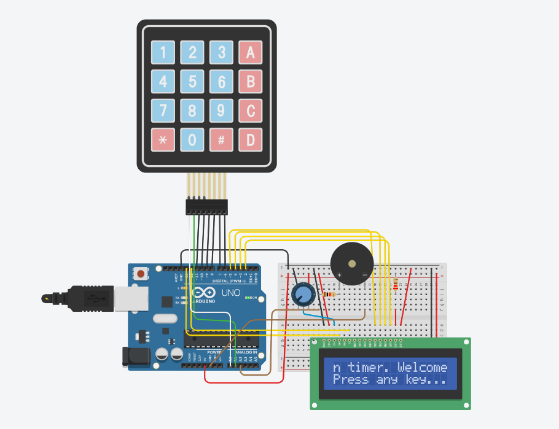

# Arduino Kitchen Timer

## Overview

This Arduino project is a kitchen timer with a user-friendly interface. The timer allows the user to input a specific duration using a keypad and displays the countdown on an LCD screen. When the time is up, a buzzer will sound continuously until a key is pressed to stop it.

## Hardware Requirements

- Arduino Uno
- 16x2 LCD Display
- 4x4 Keypad
- Buzzer
- Potentiometer (for LCD contrast adjustment)
- Connecting wires
- Breadboard

## Circuit Diagram

Refer to the following circuit diagram to connect the components:



## Connections

### LCD Connections

- **RS (Register Select)**: Digital Pin 13
- **EN (Enable Pin)**: Digital Pin 12
- **D4**: Digital Pin 5
- **D5**: Digital Pin 4
- **D6**: Digital Pin 3
- **D7**: Digital Pin 2

### Keypad Connections

- **Row Pins**: A0, A1, 11, 10
- **Column Pins**: 9, 8, 7, 6

### Buzzer Connection

- **Buzzer Pin**: Analog Pin A2

### Potentiometer

- Connect the potentiometer's wiper (middle pin) to the LCD contrast pin (V0).
- Connect the other two pins of the potentiometer to +5V and GND.

## Code

### Libraries

Make sure to include the required libraries:

```cpp
#include <LiquidCrystal.h>
#include <Keypad.h>
```

### Pin Configurations

Define the pins for the LCD and Keypad:

```cpp
const int rs = 13, en = 12, d4 = 5, d5 = 4, d6 = 3, d7 = 2;
LiquidCrystal lcd(rs, en, d4, d5, d6, d7);

const byte ROWS = 4; 
const byte COLS = 4; 
char keys[ROWS][COLS] = {
  {'1','2','3','A'},
  {'4','5','6','B'},
  {'7','8','9','C'},
  {'*','0','#','D'}
};

byte rowPins[ROWS] = {A0, A1, 11, 10};
byte colPins[COLS] = {9, 8, 7, 6};
Keypad keypad = Keypad(makeKeymap(keys), rowPins, colPins, ROWS, COLS);

const int buzzerPin = A2;
```

### Variables

Declare variables to manage the timer and display:

```cpp
char *LargestText = " Welcome to the Arduino kitchen timer. ";
int iLineNumber = 0;
int iCursor = 1;

String userInput = "";
int LCDCol = 0;
int LCDRow = 0;

bool keyPressed = false;
bool timerRunning = false;
unsigned long startTime;
int countdownTime; 
bool timeUp = false;
```

### Setup
Initialize the LCD, set the buzzer pin, and start the serial communication:

```cpp
void setup() {
  lcd.begin(16, 2);
  lcd.setCursor(0, 1);
  lcd.print("Press any key...");
  lcd.setCursor(LCDCol, LCDRow);
  pinMode(buzzerPin, OUTPUT);
  Serial.begin(9600);
}
```
### Main Loop
Display the welcome message, handle key presses, and update the timer:

```cpp
void loop() {
  if (!keyPressed) {
    lcd.setCursor(1, 0);
    WelcomeDisplay();
    delay(150);
  }
  
  keyControl();
  
  if (timerRunning) {
    updateTimer();
  }

  if (timeUp) {
    tone(buzzerPin, 1000); 
  }
}
```

### Functions
Scroll the welcome message across the LCD:
```cpp
void WelcomeDisplay() {
  int iLenofLargeText = strlen(LargestText);
  if (iCursor == (iLenofLargeText - 1)) {
    iCursor = 0;
  }
  lcd.setCursor(0, iLineNumber);
  if (iCursor < iLenofLargeText - 16) {
    for (int iChar = iCursor; iChar < iCursor + 16; iChar++) {
      lcd.print(LargestText[iChar]);
    }
  } else {
    for (int iChar = iCursor; iChar < (iLenofLargeText - 1); iChar++) {
      lcd.print(LargestText[iChar]);
    }
    for (int iChar = 0; iChar <= 16 - (iLenofLargeText - iCursor); iChar++) {
      lcd.print(LargestText[iChar]);
    }
  }
  iCursor++;
}
```
### Key Control
Handle key presses for setting the timer and controlling the buzzer:
```cpp
void keyControl() {
  char key = keypad.getKey();
  const char allowedChars[] = "1234567890C*#";
  
  if (key && strchr(allowedChars, key) != NULL) {
    if (timeUp) {
      noTone(buzzerPin);
      timeUp = false;
    }

    if (!keyPressed) {
      lcd.clear();
      keyPressed = true;
      LCDCol = 0;
      LCDRow = 0;
      userInput = "";
    }
    
    if (key == 'C') {
      lcd.clear();
      LCDCol = 0;
      LCDRow = 0;
      iCursor = 0;
      userInput = "";
      timerRunning = false;
      noTone(buzzerPin);
    } else {
      Serial.println(key);
      if (LCDCol > 4) return;
      if (LCDCol == 2) {
        lcd.setCursor(LCDCol, LCDRow);
        lcd.print(':');
        LCDCol++;
      }
      lcd.setCursor(LCDCol, LCDRow);
      lcd.print(key);
      userInput += key;
      LCDCol++;
      if (LCDCol == 5) {
        startTimer();
      }
    }
  }
}
```

### Start Timer
Start the countdown timer based on user input:
```cpp
void startTimer() {
  int minutes = userInput.substring(0, 2).toInt();
  int seconds = userInput.substring(2, 4).toInt();
  countdownTime = minutes * 60 + seconds;
  startTime = millis();
  timerRunning = true;
  timeUp = false;
}
```

### Update Timer
Update the countdown timer and handle time-up scenario:
```cpp
void updateTimer() {
  unsigned long currentTime = millis();
  int elapsedTime = (currentTime - startTime) / 1000;
  int remainingTime = countdownTime - elapsedTime;
  
  if (remainingTime <= 0) {
    timerRunning = false;
    timeUp = true;
    lcd.clear();
    lcd.setCursor(0, 0);
    lcd.print("Time's up!");
    return;
  }
  
  int minutes = remainingTime / 60;
  int seconds = remainingTime % 60;
  
  lcd.setCursor(0, 0);
  lcd.print("Time left: ");
  if (minutes < 10) lcd.print('0');
  lcd.print(minutes);
  lcd.print(':');
  if (seconds < 10) lcd.print('0');
  lcd.print(seconds);
}
```

## Features to be added later on.

### Countdown Timer Settings Menu:
A settings menu to adjust the timer length, alarm sound, etc.

### Visual Feedback:
Use an RGB LED to provide visual feedback. For example, green when the timer is running, yellow when paused, and red when time is up.

### User Input Validation:
Validate user input to ensure it is within reasonable bounds (e.g., not setting a timer for 99 minutes).

### Button Debouncing:
Button debouncing for more reliable button presses.

### - Feel free to expand on these features to enhance the functionality of your kitchen timer project. Happy coding!